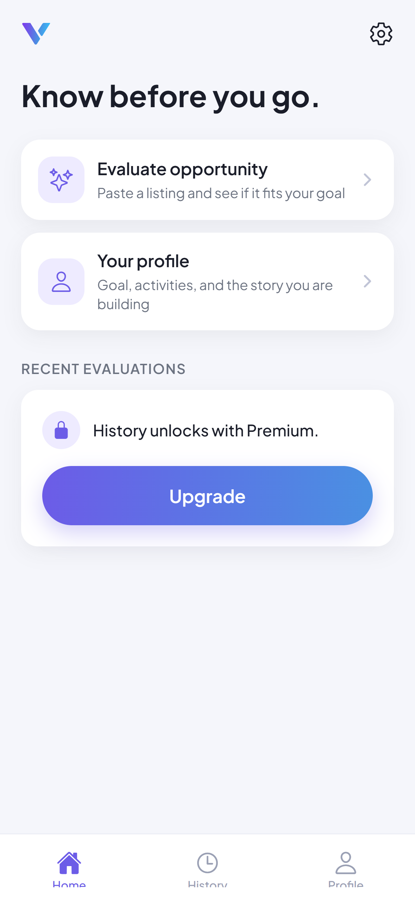
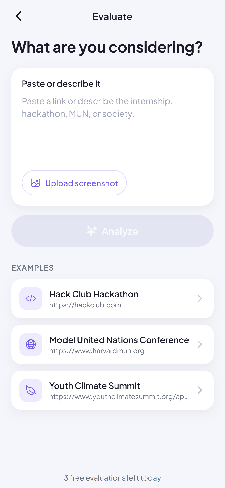
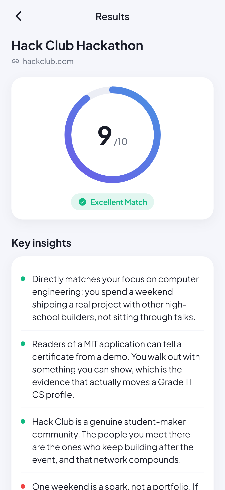
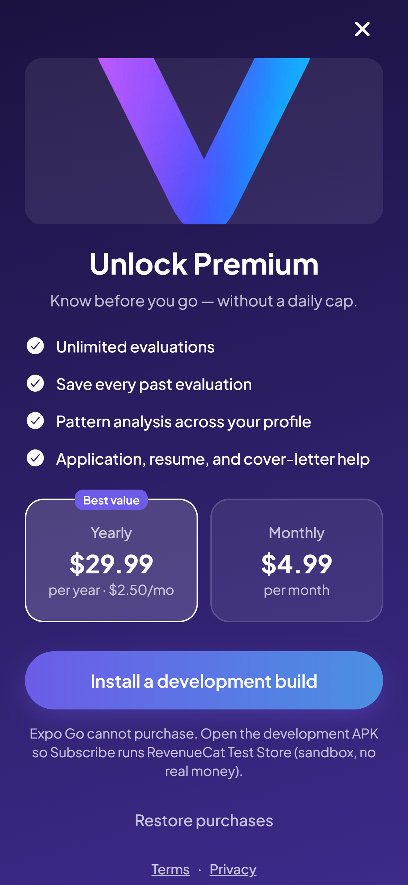
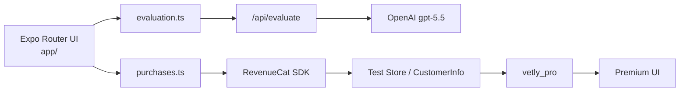

# Vetly

**know before you go**

[](LICENSE)
[](https://docs.expo.dev)
[](docs/REVENUECAT_INTEGRATION.md)

Paste an opportunity (internship, hackathon, MUN, society). Vetly scores it against *your* goals so you know if it is worth the time **before** you apply. Reverse discovery — not another feed of listings.

Built for students. **Shipaton 2026 Next Gen.** Solo project by a 16-year-old. The app exists today (not a 9-day sprint plan).

**Demo video:** you must record and add this on Devpost yourself. This repo does not include a video — do not submit without one.

**Try it**

| | URL |
|---|---|
| **Android APK** (standalone preview — judges: install this; includes Evaluate + paywall) | https://expo.dev/artifacts/eas/RBdtHXWnuqIffU_9WB2NupNk04PthSau379P9p8-tJE.apk |
| EAS build page | https://expo.dev/accounts/vetly/projects/vetly/builds/f7a0322b-334c-405c-827f-304f09cc2cca |
| Live scoring API (public base, no secrets) | https://vetly--8ysj4vvefb.expo.app |
| Web preview (UI only — **does not** run AI scoring yet) | https://vetly-f99d6523.netlify.app |
| GitHub | https://github.com/Hassan-jamshaid-dev/Vetly |

Live scoring uses OpenAI **gpt-5.5** on the server (`OPENAI_API_KEY`). The key is never in the app binary or this repo.

Docs: [Architecture](docs/ARCHITECTURE.md) · [RevenueCat](docs/REVENUECAT_INTEGRATION.md)

### Screenshots

Product shots from `assets/screenshots/` (1179×2556, no device frame). Paywall prices in the **app** are **$10.99 / month** and **$80.99 / year**.

<p>
  
  
  
  
</p>

---

## Contents

1. [Product](#product)
2. [For judges](#for-judges)
3. [How the app works (user flows)](#how-the-app-works-user-flows)
4. [How the code works (architecture)](#how-the-code-works-architecture)
5. [Tech stack](#tech-stack)
6. [Folder map](#folder-map)
7. [Setup](#setup)
8. [RevenueCat dashboard](#revenuecat-dashboard)
9. [CI](#ci)
10. [Submission notes](#submission-notes)
11. [License](#license)

---

## Product

Discovery apps keep showing more listings. Students already find internships, hackathons, MUNs, and societies — the expensive part is saying yes. Vetly is **reverse discovery**: you bring an opportunity you already found, and the app scores it against the goal you wrote.

The core loop is short:

1. Write who you are and what you want (300–1000 characters on free).
2. Paste a link, description, or screenshot of something you are considering.
3. Read a 1–10 match score, insights, and (on Premium) preparation guidance.
4. Decide whether to spend the weekend — or skip it.

### Free vs Premium

| | Free | Premium (`vetly_pro`) |
|---|---|---|
| Login | Not required | Not required. Sign-in is a **demo identity**, not a paywall. |
| Evaluations | 3 per local calendar day | Unlimited |
| Goal length | Minimum **300 characters**, maximum **1000 characters** | Minimum 20 words, maximum **2000 words** |
| Results | Title, source, score, label, key insights | Same, plus unlocked guidance |
| Form-fill help | Not available | Opens only when the opportunity looks like an **application / form** |
| History tab | Locked teaser → paywall | On-device list (newest first, capped at 50) plus a pattern card |
| Home “Recent evaluations” | Locked | Last three saved evaluations |
| Structured profile | Optional demo sign-in; guest sees the goal | Post-subscribe onboarding (grade, career, situation, optional universities and resume) |

Signing in does **not** unlock Premium. Premium is granted only when RevenueCat `CustomerInfo` has an active **`vetly_pro`** entitlement (or, in Expo Go `__DEV__` only, a labeled local demo unlock that is **not** a store purchase).

Live evaluations call a **server** route (`POST /api/evaluate`) that scores with OpenAI **gpt-5.5**. The OpenAI key stays server-side only (`OPENAI_API_KEY` / `OPENAI_MODEL` on the host). Never put a real key in `EXPO_PUBLIC_*` or commit `.env`. Leave `EXPO_PUBLIC_CLAUDE_API_KEY` empty (legacy placeholder).

**What Analyze sends**

| | Free | Premium |
|---|---|---|
| Opportunity text (+ screenshot flag) | Yes | Yes |
| Saved goal | Yes | Yes |
| Grade, universities, career, activities, situation | No | Yes (when the structured profile exists) |
| Resume file bytes / local URI | Never | Never |

Screenshot image bytes stay on device; only a `hasScreenshot` flag is sent. Netlify’s static web preview cannot run the API route, so AI scoring is for the **APK** (and local/EAS Hosting with the server), not https://vetly-f99d6523.netlify.app.

---

## For judges

**Skip signup.** There is no production auth and no judge password. Next Gen does **not** require an App Store / Play listing — Test Store on the preview APK is enough for Subscribe.

### Guest path (recommended)

1. Install the **standalone Android APK** (not Expo Go): https://expo.dev/artifacts/eas/RBdtHXWnuqIffU_9WB2NupNk04PthSau379P9p8-tJE.apk — [build page](https://expo.dev/accounts/vetly/projects/vetly/builds/f7a0322b-334c-405c-827f-304f09cc2cca).
2. Open the app. After splash, tap **Get Started**. Do not tap demo sign-in / Google / Apple.
3. Write a goal (300–1000 characters) or paste the on-screen Grade 11 / Waterloo / MIT example → **Continue**.
4. Home → **Evaluate Opportunity**. Paste an opportunity *or* tap an example card → **Analyze**. Scoring hits the public API at https://vetly--8ysj4vvefb.expo.app (OpenAI **gpt-5.5** on the server).
5. Read the score vs your goal. That is the product: know before you go.

Onboarding copy says “No login required. Skip the demo sign-up.”

### Demo Google / Apple (optional)

Email / Google / Apple on **Sign up** are **simulated** (labeled demo in the UI). Passwords stay on that screen and are **never saved**. After Continue, you go to Goal (if none is saved) or Home. You still need RevenueCat for Premium.

### Expo Go vs standalone APK vs web

| What to test | Where |
|---|---|
| Reverse discovery + **live AI scoring** | **Standalone APK** (recommended for judges). |
| Subscribe / `vetly_pro` | **Standalone APK** (native IAP / RevenueCat Test Store). Expo Go and web cannot complete checkout. |
| UI-only web preview | https://vetly-f99d6523.netlify.app — **does not** run AI scoring yet (static Netlify; no server route). |

**Standalone Android APK (judges):** https://expo.dev/artifacts/eas/RBdtHXWnuqIffU_9WB2NupNk04PthSau379P9p8-tJE.apk  
**EAS build:** https://expo.dev/accounts/vetly/projects/vetly/builds/f7a0322b-334c-405c-827f-304f09cc2cca  
**Scoring API base (no secrets):** https://vetly--8ysj4vvefb.expo.app  
**Web:** https://vetly-f99d6523.netlify.app (UI preview only; no live scoring, no IAP). If that URL asks for a Netlify login, set **Project configuration → General → Visitor access → Project visibility → Public**.

**RevenueCat Test Store (sandbox):** purchases in the APK do **not** charge a real card. Prices shown: **$10.99/month** and **$80.99/year**. Subscribe uses `Purchases.purchasePackage` or `RevenueCatUI.presentPaywall`. Do not treat the Expo Go control **Unlock demo (not billed · not a store purchase)** as the Shipaton purchase — that control is `__DEV__` and local-only. **Web / Netlify cannot complete checkout.**

There is no TestFlight yet.

**Bundle id / package:** `com.vetly.app`  
**EAS project id:** `84c1a658-cca3-4e5d-a4a1-ef58c21758ee`

---

## How the app works (user flows)

Expo Router file routes under `app/`. The root stack starts at splash (`app/index.tsx`). Tabs are Home, History, and Profile. Evaluate, Results, Paywall, Settings, and the rest sit on the stack above the tabs.

### Splash (`/`)

Shows the Vetly mark and tagline **Know before you go.** After a short brand beat (~900 ms):

- If a goal is already saved and `DEMO_FORCE_FIRST_RUN` is `false` (the product default in `src/config/demo.ts`) → **Home**.
- Otherwise → **Onboarding**.

If `DEMO_FORCE_FIRST_RUN` is flipped to `true` (recording only; do not commit `true`), splash resets the demo session (signed out, not Premium, 0/3 usage, empty history / goal / profile, Supabase sign-out). A development build then **restores Premium from RevenueCat** if `vetly_pro` is still active, so a real Test Store purchase still wins. Expo Go keeps the simulated flag cleared.

### Onboarding (`/onboarding`)

Value proposition: “Your goals. Your profile. Your next move.”

- **Get Started** → Goal. Guest path.
- **Demo sign-in (not real accounts)** → Sign up.

### Goal (`/goal`)

The user describes who they are and what they are aiming for. Every later evaluation is scored against this text.

- First run: **Continue** saves the goal and resets the stack to Home (back cannot return to splash / onboarding).
- From Settings: `/goal?mode=edit` → **Save** returns to Settings.

Free: 300–1000 characters (no 20-word check). Premium: 20+ words, 2000-word cap (not a 1000-character cap).

### Sign up (`/signup`) — not Premium

Simulated account: name, email, password (never persisted). **Continue with Google (demo)** / **Continue with Apple (demo)** finish the same local sign-in. This never calls `setIsPremium`, never opens the paywall, and never starts premium onboarding.

### Home (`/(tabs)/home`)

Dashboard: greeting (and first name if demo-signed-in), **Evaluate Opportunity**, **Your Profile**, and Recent Evaluations.

- Free: recent list is locked; **Upgrade** opens the paywall.
- Premium: last three evaluations; tap one to open Results. If Supabase is configured, Home also merges remote rows into local history.

The gear opens **Settings**.

### Evaluate (`/evaluate`)

Paste a link or description (max 2000 characters) and/or **Upload Screenshot** (`expo-image-picker`). Three example cards fill the field with sample opportunity copy.

**Analyze:**

- Free with 0 remaining today → paywall (the evaluation is not run).
- Otherwise the client POSTs to `/api/evaluate` (absolute URL on native via `EXPO_PUBLIC_API_URL`, e.g. https://vetly--8ysj4vvefb.expo.app):
  - **Free:** opportunity text + goal (+ screenshot flag). No premium profile fields.
  - **Premium:** same, plus grade, universities, career, activities, situation when the structured profile exists.
  - Resume **file bytes** and local URI are **never** sent.
  - Server scores with OpenAI **gpt-5.5**; key stays on the host.
  - Premium: append to local History.
  - Free: consume one of the three daily slots (resets at **local** midnight).
  - **Always** (best-effort): upsert to Supabase if configured. Cloud failure never blocks Analyze.
  - Put the result in the in-memory store and push **Results**.

Footer: remaining free evaluations, or “Unlimited evaluations” on Premium.

### Results (`/results`)

Score ring (1–10), label (**Excellent Match** 8–10, **Good Match** 5–7, **Low Match** 1–4), and key insights.

- Free: guidance is a **LockedCard** → paywall.
- Premium: **GuidanceCard**. If `hasApplication` is true, a **How to fill this form** button opens Application Help. If the opportunity is an event to attend rather than a form, that button is omitted — form-help is not extra homework on top of a go / no-go call.

**Evaluate another** returns to Evaluate.

### Form-help vs evaluation

| Evaluation (`/results`) | Form help (`/application-help`) |
|---|---|
| Should I spend time on this vs my goal? | How do I fill *this* application using my saved profile? |
| Always shown after Analyze | Premium only, and only when the pasted text looks like apply / form / deadline / essay / internship / etc. |
| Insights + score | Numbered steps, what to highlight, what to be careful of, copyable starter paragraph (the evaluation’s `guidance`) |

Deep-linking into form-help without Premium redirects to the paywall. Non-application evaluations redirect back to Results.

### Paywall (`/paywall`)

Plans match dashboard products: **Yearly $80.99** (best value, ≈ $6.75/mo) and **Monthly $10.99**.

On a development / store build with a public SDK key:

- **Subscribe** calls `purchaseSelectedPlan` → `Purchases.purchasePackage` for `$rc_annual` or `$rc_monthly` (matched by product id `vetly_pro_yearly` / `vetly_pro_monthly`).
- If the current offering has no packages, Subscribe falls back to **`RevenueCatUI.presentPaywall`**.
- **RevenueCat Paywall** presents the dashboard paywall directly.
- **Restore Purchases** calls `Purchases.restorePurchases`.
- Success is accepted **only** after `vetly_pro` is active on `CustomerInfo`. Test Store: sandbox, **$0**.

On Expo Go: primary CTA is **Install a development build**. Restore explains that Expo Go cannot restore a store purchase.

On **web / Netlify**: checkout cannot complete (no native IAP). Prices still show **$10.99/month** and **$80.99/year**. Use the standalone APK for Subscribe.

After a real unlock (or the labeled `__DEV__` demo unlock), if the structured premium profile is incomplete → **Premium onboarding**. If the user just analyzed something, that evaluation is saved to History.

### Premium onboarding (`/premium-onboarding`) and Resume (`/resume`)

After Upgrade, a structured profile: grade level, optional target universities, dream career, current activities, situation (≥20 characters). Continue writes `src/storage/profileStorage.ts`. If Analyze still has no goal text, the profile is turned into a goal string.

Then **Resume**: optional PDF or image. Only a **local URI + file name** are stored. Bytes are never uploaded, never parsed, never committed. Skip is allowed; Profile / Settings can add a file later. First-time setup then lands on Home, or Results if an evaluation is still in memory (so Unlock from Results still shows the guidance they paid for).

`/premium-onboarding?mode=edit` and `/resume?mode=edit` return to Profile instead of continuing the first-run chain.

### History (`/(tabs)/history`)

Free: locked. Premium: newest-first list plus a **pattern** card from `src/services/coherence.ts` (deterministic over titles + profile — not a second live model call). Tap a row → Results.

### Profile (`/(tabs)/profile`)

Guest: goal preview, **Edit your goal**, **Demo sign-in**.  
Signed-in or structured profile: person page (name, chips, goal, activities, resume row). Gear → Settings.

### Settings (`/settings`)

Edit goal, optional **Add resume**, About / Privacy / Terms (`/legal?page=…`), **Restore purchases**, and **Manage subscription** (RevenueCat Customer Center when the native UI SDK is present). Free users see **Upgrade to Premium**. Demo accounts can **Log out** (clears the simulated session; does not revoke `vetly_pro`). Footer: `Vetly 1.0.0 · know before you go`.

---

## How the code works (architecture)

Longer write-up: [docs/ARCHITECTURE.md](docs/ARCHITECTURE.md). Billing details: [docs/REVENUECAT_INTEGRATION.md](docs/REVENUECAT_INTEGRATION.md).

```
app/                         Expo Router screens
app/api/evaluate+api.ts      Server POST /api/evaluate (OpenAI gpt-5.5)
src/server/openaiModel.ts    Default model id (gpt-5.5) / OPENAI_MODEL override
src/services/evaluation.ts   Client seam → fetch evaluate API
src/services/purchases.ts    RevenueCat SDK + UI (do not replace with a second billing class)
src/services/evaluationCloud.ts  Optional Supabase upsert / fetch
src/storage/*                AsyncStorage (and SecureStore for demo session)
src/lib/supabase.ts          Anon client + anonymous sign-in
src/config/demo.ts           First-run / recording switch
```



TypeScript path alias: `@/` → `src/` (`tsconfig.json`).

### Boot

`app/_layout.tsx` holds the native splash until Plus Jakarta Sans is ready, then hides it. On mount it calls `configurePurchases()` and, if native IAP is available, `refreshPremiumFromRevenueCat()`. `unstable_settings.initialRouteName` is `index` (splash).

`configurePurchases` is a no-op in Expo Go, on web, or when `EXPO_PUBLIC_REVENUECAT_API_KEY` is empty. It never uses a secret REST key.

### Analyze data flow

```
Evaluate.handleAnalyze
  → getIsPremium / getRemainingToday (free cap)
  → evaluateOpportunity(input, goal, profile|null)  // POST /api/evaluate
  → Premium: appendHistory ; Free: consumeOne
  → saveEvaluationRemote(evaluation)              // fire-and-forget upsert
  → setCurrentEvaluation(evaluation)
  → router.push('/results')
```

`saveEvaluationRemote` (`src/services/evaluationCloud.ts`):

- No-op if Supabase env vars are missing.
- `requireUserId()` reuses or creates an **anonymous** session (`auth.uid()`).
- Upserts `evaluations` on conflict `(user_id, id)` with `title`, `score`, JSON `payload`, `created_at`.
- Skips payloads larger than 32,000 characters (matches `supabase/setup.sql`).
- Errors are logged; Analyze still succeeds.

Home and History then `fetchRemoteEvaluations` and `mergeRemoteHistory` (newest first, cap 50).

Local History (`vetly:history`) is **Premium-only**. Free Analyze still may upsert to Supabase; the History tab does not show those rows until `vetly_pro` is active.

### Evaluation engine (live OpenAI, server-side)

`src/services/evaluation.ts` is the client seam: it POSTs JSON to `/api/evaluate` and maps the response into `Evaluation`. Native/APK builds need `EXPO_PUBLIC_API_URL` (public base only — currently https://vetly--8ysj4vvefb.expo.app). Local web/dev can use a relative path when the Expo server export is running.

`app/api/evaluate+api.ts` reads `OPENAI_API_KEY` (and optional `OPENAI_MODEL`, default **gpt-5.5** via `src/server/openaiModel.ts`). Secrets never ship in the client or this repo.

**Context sent to the model**

- **Free:** opportunity text + goal (+ `hasScreenshot` flag). Resume bytes are never sent.
- **Premium:** also grade, universities, dream career, activities, situation when the structured profile exists.
- History is **not** in this call (History-tab `coherence.ts` only). Screenshot **image bytes** stay on device.

`src/services/score.ts` maps the integer to label and color. `src/types/evaluation.ts` is the UI contract.

### RevenueCat

| Constant | Value |
|---|---|
| Entitlement | `vetly_pro` |
| Products | `vetly_pro_monthly` ($10.99), `vetly_pro_yearly` ($80.99) |
| Packages | `$rc_monthly`, `$rc_annual` |

`src/storage/premiumStorage.ts` is a **cache** (`vetly:isPremium`). Native builds treat RevenueCat as source of truth: `setPremiumFromCustomerInfo` writes `true` **only** when `entitlements.active.vetly_pro` exists. A failed refresh does not invent Premium. Expo Go does not overwrite a labeled demo unlock with a missing entitlement.

Customer Center (`RevenueCatUI.presentCustomerCenter`) is opened from Settings; on dismiss, Premium is refreshed again.

### Auth vs Premium vs cloud identity

Three separate things:

1. **Demo sign-in** — name + email in SecureStore / AsyncStorage. Password never written. Independent of Premium.
2. **Premium** — RevenueCat `vetly_pro` (or `__DEV__` Expo Go demo flag).
3. **Supabase anonymous user** — `auth.uid()` for RLS on `evaluations`. Not shown in the UI. Demo logout does not delete cloud rows; Settings copy says evaluations may remain under the anonymous user.

### Storage keys (on device)

| Module | Role |
|---|---|
| `goalStorage` | Goal text; splash uses this to skip onboarding |
| `usageStorage` | `{ date, count }` for the free daily cap of 3 |
| `premiumStorage` | Local Premium boolean |
| `historyStorage` | Premium evaluation log |
| `profileStorage` | Structured premium profile + resume URI/name |
| `authStorage` | Simulated account |
| `evaluationStore` | In-memory current evaluation (not persisted) |

---

## Tech stack

As used in `package.json` / `app.json` (not a wishlist):

- **Expo SDK 57** (`expo ~57.0.20`), **React Native 0.86**, **React 19**, New Architecture enabled
- **Expo Router** (`expo-router ~57.0.19`), typed routes, React Compiler experiment
- **Expo Dev Client** (`expo-dev-client`) for development / EAS builds
- **RevenueCat:** `react-native-purchases` + `react-native-purchases-ui` ^10.9.1 (Test Store sandbox now; Apple / Google public SDK keys later)
- **Supabase:** `@supabase/supabase-js`, anonymous sign-in, `evaluations` table with RLS (`supabase/setup.sql`)
- **AsyncStorage** for goal, usage, history, profile, Premium cache
- **expo-secure-store** for demo session and native Supabase auth storage (AsyncStorage fallback on web)
- **expo-image-picker**, **expo-document-picker**, **expo-clipboard**, **expo-haptics**, **expo-linear-gradient**, **expo-font**, **expo-splash-screen**, **expo-constants**
- **Plus Jakarta Sans** (`@expo-google-fonts/plus-jakarta-sans`)
- **Reanimated** 4, Gesture Handler, Screens, Safe Area, SVG, Masked View
- **TypeScript** (strict)

There are **no committed `ios/` or `android/` folders** (managed workflow; those directories are gitignored). Generate them with `npx expo run:android` / `run:ios` or EAS.

---

## Folder map

```
Vetly/
├── app/                          File-based routes (Expo Router)
│   ├── _layout.tsx               Root stack, fonts, RevenueCat configure
│   ├── index.tsx                 Splash
│   ├── onboarding.tsx            Get Started / demo sign-in
│   ├── goal.tsx                  Goal capture and edit
│   ├── signup.tsx                Simulated email / Google / Apple
│   ├── evaluate.tsx              Paste / screenshot / Analyze
│   ├── results.tsx               Score, insights, locked or full guidance
│   ├── application-help.tsx      Premium form-fill steps
│   ├── paywall.tsx               Yearly / monthly Subscribe
│   ├── premium-onboarding.tsx    Structured profile after Upgrade
│   ├── resume.tsx                Optional local resume file
│   ├── settings.tsx              Restore, Customer Center, legal
│   ├── legal.tsx                 About / Privacy / Terms
│   ├── api/
│   │   └── evaluate+api.ts       Server: OpenAI gpt-5.5 scoring
│   └── (tabs)/
│       ├── _layout.tsx           Home / History / Profile tab bar
│       ├── home.tsx              Dashboard
│       ├── history.tsx           Premium history + pattern card
│       └── profile.tsx           Person page or guest goal
├── src/
│   ├── server/
│   │   └── openaiModel.ts        Default gpt-5.5 / OPENAI_MODEL
│   ├── services/
│   │   ├── evaluation.ts         Client POST → /api/evaluate
│   │   ├── formHelp.ts           Application detection helpers
│   │   ├── score.ts              1–10 → label and color
│   │   ├── coherence.ts          History pattern analysis
│   │   ├── purchases.ts          RevenueCat configure / buy / restore / paywall / Customer Center
│   │   └── evaluationCloud.ts    Supabase upsert and fetch
│   ├── storage/                  AsyncStorage helpers (goal, usage, premium, history, profile, auth)
│   ├── lib/supabase.ts           Client, SecureStore auth, anonymous requireUserId
│   ├── store/evaluationStore.ts  In-memory current evaluation
│   ├── config/demo.ts            DEMO_FORCE_FIRST_RUN
│   ├── demo/resetDemoSession.ts  Recording reset + RC restore
│   ├── types/evaluation.ts       Evaluation / Insight shapes
│   ├── types/evaluateApi.ts      Request/response for /api/evaluate
│   ├── content/legal.ts          About, privacy, terms copy
│   ├── navigation/               Reset-to-Home helpers, query-param helper
│   ├── theme/                    colors, typography, shadows
│   ├── components/               Buttons, cards, score ring, locked card, tab icons, decor
│   └── utils/                    dialog, relativeTime
├── supabase/setup.sql            evaluations table + RLS
├── docs/                         ARCHITECTURE.md, REVENUECAT_INTEGRATION.md
├── .github/                      CI workflow + issue templates
├── assets/images/                App icon, paywall hero
├── assets/screenshots/           1179×2556 PNGs (home, evaluate, results, paywall)
├── app.json                      Name, scheme vetly, bundle id, EAS projectId, web output server
├── eas.json                      development / preview / production profiles
├── .env.example                  Placeholder env names only (no secrets)
└── package.json                  Scripts: start, typecheck, ci, run:android, eas:dev
```

---

## Setup

```bash
git clone https://github.com/Hassan-jamshaid-dev/Vetly.git
cd Vetly
cp .env.example .env
npm ci
npx expo start
```

Copy `.env.example` → `.env`. Empty placeholders only. For sandbox IAP, put the RevenueCat **Test Store public** SDK key in `EXPO_PUBLIC_REVENUECAT_API_KEY` (never the secret REST key). For APK scoring, set `EXPO_PUBLIC_API_URL` to the public API base (no trailing slash) and put `OPENAI_API_KEY` only on the **server** host (EAS Hosting / local API) — never in the client. Restart Metro after changing `.env`. Different networks: `npx expo start --tunnel`.

| Variable | What it is |
|---|---|
| `EXPO_PUBLIC_SUPABASE_URL` | Project URL (`https://….supabase.co`). Optional. |
| `EXPO_PUBLIC_SUPABASE_ANON_KEY` | Publishable / anon key. Never `service_role`. |
| `EXPO_PUBLIC_REVENUECAT_API_KEY` | Test Store **public** SDK key. Unused in Expo Go. Never the secret REST key. |
| `EXPO_PUBLIC_API_URL` | Public scoring API base (URL only), e.g. `https://vetly--8ysj4vvefb.expo.app`. Never a key. |
| `EXPO_PUBLIC_CLAUDE_API_KEY` | Leave empty (legacy). Do not put OpenAI or Claude secrets in `EXPO_PUBLIC_*`. |
| `OPENAI_API_KEY` | **Server-only.** Used by `app/api/evaluate+api.ts`. Never commit a real value. |
| `OPENAI_MODEL` | Optional server override; defaults to **gpt-5.5**. |
| `REVENUECAT_SECRET` | Optional, **local catalog scripts only**. Never `EXPO_PUBLIC_`. Never commit a real value. |

- **Expo Go** (`npx expo start`): JS app; IAP unavailable. Scoring needs a reachable API.
- **Preview APK:** https://expo.dev/artifacts/eas/RBdtHXWnuqIffU_9WB2NupNk04PthSau379P9p8-tJE.apk — live Evaluate + Test Store paywall. Not Expo Go. [Build page](https://expo.dev/accounts/vetly/projects/vetly/builds/f7a0322b-334c-405c-827f-304f09cc2cca).
- **Web (Netlify):** https://vetly-f99d6523.netlify.app — UI preview only; **does not** run AI scoring yet.
- **IAP locally:** a binary that includes native purchases, then `npx expo start --dev-client`.

```bash
npx expo run:android
# macOS: npx expo run:ios
# or: npm run eas:dev   # EAS development profile (Android APK for judges)
```

**Bundle identifier / Android package:** `com.vetly.app`  
**EAS:** `extra.eas.projectId` is `84c1a658-cca3-4e5d-a4a1-ef58c21758ee` (`app.json`). Profiles in `eas.json`: `development` (dev client, internal), `preview` (internal), `production`.

Optional Supabase: enable **Anonymous sign-in** in the dashboard, run `supabase/setup.sql` (creates `public.evaluations`, forces RLS, grants `authenticated` only). Analyze still works if URL/anon key are unset.

---

## RevenueCat dashboard

Sandbox now; App Store / Play later. Do not ship a Test Store public key to production.

**Entitlement:** `vetly_pro`

**Test Store products**

| Product id | Price (copy in the app) |
|---|---|
| `vetly_pro_monthly` | $10.99 / month |
| `vetly_pro_yearly` | $80.99 / year (≈ $6.75/mo) |

Update Test Store product prices in the RevenueCat dashboard to match, or the sandbox modal shows old amounts.

**RevenueCat Project ID:** not stored in this repo. Copy the `proj…` value from the RevenueCat dashboard (Project settings) if Devpost asks for it.

**Current offering packages:** `$rc_monthly` and `$rc_annual`, attached to those products and to `vetly_pro`. Add a dashboard Paywall on the current offering if you want **RevenueCat Paywall** / the no-packages fallback.

**Demo Subscribe on a development build (not Expo Go):**

1. Put the Test Store **public** SDK key in `EXPO_PUBLIC_REVENUECAT_API_KEY`, restart Metro, reopen the dev client.
2. Open the paywall → **Subscribe** (`purchasePackage`) or **RevenueCat Paywall** (`presentPaywall`).
3. Confirm `vetly_pro` is active (unlimited evals / History). Settings → Restore purchases / Manage subscription.

Expo Go shows **Install a development build**. The `__DEV__` “Unlock demo (not billed)” control is local-only and is **not** the Shipaton purchase.

**Go live later:** keep bundle id `com.vetly.app`. Create the same product ids on App Store Connect and Google Play, attach them to the same `vetly_pro` entitlement, then swap `.env` to Apple / Google **public** SDK keys (still never the secret REST key). **Shipaton 2026 Next Gen does not require a store listing.**

---

## CI

`.github/workflows/ci.yml` runs on push and pull request: checkout, Node 20, `npm ci`, `npm run typecheck` (`tsc --noEmit`). There is no `npm run build` in this app. ESLint is not configured, so `expo lint` is not in CI. `npm audit --audit-level=high` is `continue-on-error` because React Native trees often fail audit.

A GitHub Actions badge is omitted on purpose until this workflow is on GitHub (the badge URL would 404). After you push, you can add:

`https://github.com/Hassan-jamshaid-dev/Vetly/actions/workflows/ci.yml/badge.svg`

---

## Submission notes

Paste into Devpost as needed.

### Idea & impact

Discovery apps keep showing more listings. Students already find internships, hackathons, MUNs, and societies — the expensive part is saying yes. Vetly is reverse discovery: paste what you found, get a score against your actual goals, then decide. Know before you go. Built solo by a 16-year-old, for students. **Shipaton 2026 Next Gen.**

### Challenges & learnings

Expo Go cannot run native IAP, so Subscribe only works on a development / EAS build. RevenueCat Test Store is a real SDK purchase (`purchasePackage` / `presentPaywall` → entitlement `vetly_pro`), not a fake local unlock — sandbox does not charge a real card. Keeping Google/Apple sign-in honest (demo, not production auth) and moving scoring to a **server-side** OpenAI key (never `EXPO_PUBLIC_`) mattered more than polishing another feed. Netlify static hosting cannot run the API route, so judges use the APK for live scoring. Optional Supabase stays best-effort so Analyze never depends on the cloud DB.

### What’s next

Same `vetly_pro` products on App Store / Play. Wire AI scoring into a web host that can run the API (or keep EAS Hosting as the scoring backend for web). Production auth can replace the simulated Google / Apple buttons without changing the guest path.

### Links for Devpost fields

- **GitHub:** https://github.com/Hassan-jamshaid-dev/Vetly
- **Website / web preview:** https://vetly-f99d6523.netlify.app (UI only — no AI scoring yet)
- **Android APK:** https://expo.dev/artifacts/eas/RBdtHXWnuqIffU_9WB2NupNk04PthSau379P9p8-tJE.apk
- **EAS build:** https://expo.dev/accounts/vetly/projects/vetly/builds/f7a0322b-334c-405c-827f-304f09cc2cca
- **Scoring API base:** https://vetly--8ysj4vvefb.expo.app (no secrets)
- **Screenshots:** `assets/screenshots/` (home, evaluate, results, paywall — 1179×2556, no device frame)
- **Video:** paste your Devpost video URL here after you upload it. **You must add the video on Devpost; this project does not include one.**
- **Scoring:** OpenAI **gpt-5.5** via server. Key not in app or repo.

### Before you click Submit

1. Record and upload the Devpost demo video (required; not in this repo).
2. Confirm Netlify visitor access is **Public** so judges are not asked to log in.
3. If you are under 18, complete any guardian / parental-consent step Devpost shows.
4. Copy the RevenueCat `proj…` id from the dashboard only if a form field asks for it.

---

## License

MIT
