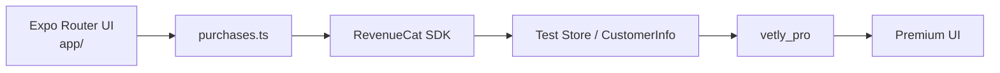

# Vetly architecture

This is the architecture **as the repo exists**. Expo Router lives in `app/`. Billing lives in `src/services/purchases.ts`. There is no JWT API gateway, no `src/app` tree, no Zustand store, and no Stripe / OneSignal.

Path alias: `@/` → `src/` (`tsconfig.json`).

## What the app is

Vetly is reverse discovery: the student pastes an opportunity they already found; the app scores it against **their** goal. Screens are Expo Router file routes. The root stack starts at splash (`app/index.tsx`). Tabs are Home, History, and Profile. Evaluate, Results, Paywall, Settings, and the rest sit on the stack above the tabs.

```text
app/                         Expo Router screens (do not move these into src/app)
src/services/evaluation.ts   Mock “brain” (evaluateOpportunity)
src/services/purchases.ts    RevenueCat SDK + UI (the billing isolation layer)
src/services/evaluationCloud.ts  Optional Supabase upsert / fetch
src/storage/*                AsyncStorage (SecureStore for demo session)
src/lib/supabase.ts          Anon client + anonymous sign-in
src/store/evaluationStore.ts In-memory current evaluation (not Zustand)
src/config/demo.ts           First-run / recording switch
```

## Screens (Expo Router)

| Route | File | Role |
|---|---|---|
| `/` | `app/index.tsx` | Splash. Goal saved → Home; otherwise Onboarding. |
| `/onboarding` | `app/onboarding.tsx` | Get Started (guest) or demo sign-in. |
| `/goal` | `app/goal.tsx` | Goal capture. Free: 300–1000 characters. Premium: 20+ words, 2000-word cap. |
| `/signup` | `app/signup.tsx` | Simulated email / Google / Apple. **Not** Premium. Passwords never saved. |
| `/(tabs)/home` | `app/(tabs)/home.tsx` | Dashboard. Recent evaluations locked on free. |
| `/evaluate` | `app/evaluate.tsx` | Paste / screenshot / Analyze. |
| `/results` | `app/results.tsx` | Score 1–10, insights; guidance locked on free. |
| `/application-help` | `app/application-help.tsx` | Premium form-fill steps when the paste looks like an application. |
| `/paywall` | `app/paywall.tsx` | Yearly $80.99 / Monthly $10.99. |
| `/premium-onboarding` | `app/premium-onboarding.tsx` | Structured profile after Upgrade. |
| `/resume` | `app/resume.tsx` | Optional local resume URI + filename only. |
| `/(tabs)/history` | `app/(tabs)/history.tsx` | Premium history + pattern card. |
| `/(tabs)/profile` | `app/(tabs)/profile.tsx` | Guest goal or person page. |
| `/settings` | `app/settings.tsx` | Restore, Customer Center, legal, demo log out. |
| `/legal` | `app/legal.tsx` | About / Privacy / Terms. |

`app/_layout.tsx` holds the native splash until Plus Jakarta Sans loads, then calls `configurePurchases()` and, if native IAP is available, `refreshPremiumFromRevenueCat()`. `unstable_settings.initialRouteName` is `index`.

## Evaluation engine (mock, not Claude)

`src/services/evaluation.ts` is the only seam. Keep `evaluateOpportunity(input, goal, profile)`’s signature; only the body should change when a **server-side** model is wired.

Today:

- No HTTP call. No Claude. `EXPO_PUBLIC_CLAUDE_API_KEY` must stay empty — a real key in `EXPO_PUBLIC_*` would be bundled into the client.
- Curated results for the three Evaluate examples (Hack Club **9**, MUN **7**, Climate Summit **4**).
- Generic fallback: deterministic hash of the paste → score 5–8, nudged by phrases.
- `looksLikeApplication()` (`src/services/formHelp.ts`) sets `hasApplication` and form-help steps from the structured profile when present.

`src/types/evaluation.ts` is the UI contract. A future Claude adapter must map into that shape **inside** `evaluation.ts`.

There is no REST `POST /evaluate`. Analyze is local.

## Analyze data flow

```text
Evaluate.handleAnalyze
  → getIsPremium / getRemainingToday (free cap: 3 per local calendar day)
  → evaluateOpportunity(input, goal, profile)     // always mock today
  → Premium: appendHistory ; Free: consumeOne
  → saveEvaluationRemote(evaluation)              // fire-and-forget upsert
  → setCurrentEvaluation(evaluation)
  → router.push('/results')
```

Cloud failure never blocks Analyze.

## Premium: `premiumStorage` vs RevenueCat `CustomerInfo`

Two layers, not one flag that the UI invents:

1. **`src/storage/premiumStorage.ts`** — local cache (`vetly:isPremium`). Screens read `getIsPremium()` so the UI can render before the SDK returns.
2. **RevenueCat `CustomerInfo`** — source of truth on native / development / preview APKs. `setPremiumFromCustomerInfo` in `purchases.ts` writes `true` **only** when `entitlements.active.vetly_pro` exists. A failed refresh does not invent Premium.

Expo Go cannot load native IAP. A labeled `__DEV__` “Unlock demo” control may set the local cache. That is **not** a store purchase and must not be treated as Shipaton billing.

Sign-in never writes `isPremium`.

Details: [REVENUECAT_INTEGRATION.md](./REVENUECAT_INTEGRATION.md).



## Supabase (optional, not a backend product)

No custom API. The client talks to Supabase with the **anon** key.

- `src/lib/supabase.ts` — `createClient` when `EXPO_PUBLIC_SUPABASE_URL` and `EXPO_PUBLIC_SUPABASE_ANON_KEY` are set. Session in SecureStore (AsyncStorage on web). Identity is **anonymous** `auth.uid()` (`signInAnonymously`).
- `src/services/evaluationCloud.ts` — `saveEvaluationRemote` upserts `evaluations` on conflict `(user_id, id)`; `fetchRemoteEvaluations` selects this user’s newest 50 payloads.
- `supabase/setup.sql` — table + **force RLS**. Policies: `user_id = auth.uid()`. Grants to `authenticated` only. Trigger overwrites `user_id` from `auth.uid()`.

If env vars are missing, Analyze still works. Payload cap is 32,000 characters (matches the SQL check).

Local History (`vetly:history`) is **Premium-only**. Free Analyze may still upsert; the History tab does not show those rows until `vetly_pro` is active.

## Three identities (do not collapse them)

| Identity | Where | Unlocks Premium? |
|---|---|---|
| Demo sign-in | SecureStore / AsyncStorage name + email | No |
| `vetly_pro` | RevenueCat CustomerInfo (or Expo Go demo flag) | Yes |
| Supabase anonymous user | `auth.uid()` for RLS | No |

Demo logout does not revoke `vetly_pro` and does not delete cloud rows.

## On-device storage

| Module | Key / role |
|---|---|
| `goalStorage` | Goal text; splash uses this to skip onboarding |
| `usageStorage` | `{ date, count }` free cap of 3, local midnight |
| `premiumStorage` | Local Premium boolean (cache) |
| `historyStorage` | Premium evaluation log, cap 50 |
| `profileStorage` | Structured premium profile + resume URI/name |
| `authStorage` | Simulated account |
| `evaluationStore` | In-memory current evaluation (not persisted) |

## What this repo is not

- Not a Node/Express JWT gateway.
- Not `src/app` + UI-kit atoms. Components live in `src/components`; routes stay in `app/`.
- Not Zustand. `evaluationStore.ts` is a module-level variable.
- Not live Claude, Stripe, OneSignal, or production Google/Apple auth.
